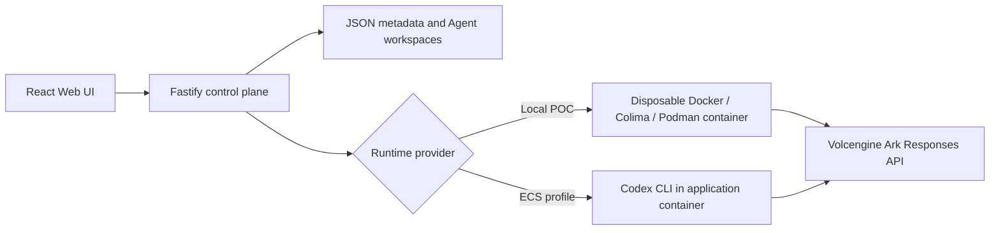

# Volc Agent Launchpad

## Our TechJam project: ScopedRun

This team has selected **Track 1: Agent Launchpad — Design and Build
Lightweight Agent Middleware**. Our middleware is **ScopedRun**, a run-scoped
resource capsule that compiles a human's explicit per-Run Resource Delegation,
bounded by a server-owned Entitlement, into the filesystem view of one Agent
Run.

The core guarantee is deliberately narrow and testable:

> A Protected Resource that is not explicitly delegated to a Run does not
> enter that Runtime's mount namespace. The MVP mounts at most one delegated
> directory and always mounts it read-only.

ScopedRun enforces this in the Fastify control plane and container launch
path, rather than relying on a resource picker, prompt instructions, or the
Agent to police itself. The demo uses two mock users and three server-owned
incident bundles: an authorized bundle can be read by a real Agent Run, while
an unauthorized bundle is rejected before the Runtime starts.

An Entitlement is only the upper bound of what a principal may delegate. The
user must explicitly choose the Resource for each Run. The deterministic
Resource Advisor can suggest one eligible bundle from safe metadata, but its
suggestions never authorize or submit a delegation.

- [Approved planning brief](docs/planning/resource-capsule-brief.md)
- [Product user flow and authorization model](docs/planning/scopedrun-user-flow.md)
- [Formal working specification](.scratch/run-scoped-resource-capsule/spec.md)
- [Implementation history](https://github.com/Simon-Xu3/Starlove-Butterfly-techjam-agent-middleware/issues?q=is%3Aissue%20label%3Ascopedrun)
- [Collaboration board](https://github.com/users/MarcusMa06-code/projects/4)
- [Architecture decision](docs/adr/001-run-scoped-resource-capsule.md)
- [Day 2 feature-freeze evidence](docs/evidence/day2-feature-freeze-2026-08-29.md)
- [Three-minute demo runbook](docs/SCOPEDRUN_DEMO.md)
- [Current final-submission audit](docs/evidence/final-submission-audit-2026-08-30.md)
- [Issue #10 delivery evidence](docs/evidence/issue-10-final-delivery-2026-08-30.md)

The submission candidate passes deterministic HTTP, authorization, path,
persistence, Advisor, Receipt, Web, and regression suites plus a real-container
namespace and host-integrity test.

A minimal Agent platform for three-day middleware hackathons. It provides Agent
CRUD, a browser Playground, persistent workspaces, and Codex CLI backed by the
Volcengine Ark Responses API.

Run it locally with Docker, Colima, or rootless Podman, or deploy it to
Volcengine ECS.

> [!WARNING]
> This is a proof of concept. `X-Demo-Session` provides two reproducible mock
> identities, while `APP_AUTH_TOKEN` is only an outer demo access guard; neither
> is production authentication. Decision Receipts are demo evidence, not a
> hardened audit system. Do not use production data or credentials. See
> [SECURITY.md](SECURITY.md).

Resource revocation is prospective: it prevents a later Runner start but does
not hot-unmount a container that is already running. It also does not erase
content that a model legitimately read into an earlier Codex thread, Message,
output, or Agent workspace. Stop the active Run when immediate containment is
required, and do not treat revocation as a model-memory erasure guarantee.

## ScopedRun flow

ScopedRun keeps standing rights separate from what an Agent actually sees:

```text
task -> eligible safe metadata -> optional advisory suggestion
     -> explicit human choice -> server recheck -> one readonly mount -> Receipt
```

An Entitlement only says which Resources a Human Principal may delegate. It
does not mount those Resources and does not give an Agent standing visibility.
For each new Run, the user explicitly chooses no Resource (a baseline Run) or
one eligible directory Resource. The server then re-resolves the mock
principal, checks Agent ownership and the current Entitlement generation,
validates the Registry-owned canonical path, and creates the mount plan.

The submission includes a deterministic Resource Advisor, but using it is
optional: the manual picker remains the complete path. The Advisor uses only
task text and entitled safe metadata. Its suggestion still requires the user
to press **Delegate for this Run** and cannot grant access, submit a Run,
inspect protected contents, or mount anything.

The demo fixtures make the distinction concrete:

| UI identity | Header value | Server principal | Initially entitled Resources |
| --- | --- | --- | --- |
| Demo User A | `demo-session-a` | `user-a` | `orders-incident`, `inventory-incident` |
| Demo User B | `demo-session-b` | `user-b` | `payments-incident` |

`X-Demo-Session` is a caller-selectable mock identity switch.
`APP_AUTH_TOKEN` is a shared outer guard for remote demos. Neither is
production authentication, principal authorization, or a design to reuse with
production identities.

| Start path | Effective Runtime | Baseline Run | Capsule Run |
| --- | --- | --- | --- |
| `npm run poc` | Per-Run local container | Supported | Supported |
| `npm run dev` (default) | Host `local-process` | Supported | Denied: `runtime_profile_unsupported` |
| Docker Compose / ECS default | Codex process in the application container | Supported | Denied: no per-Run Capsule namespace |

## Reviewer quickstart

From a clean checkout, first run the deterministic quality gate:

```bash
npm ci
npm run check
```

Then prove the filesystem boundary with a running Docker, Colima, or Podman
engine. Colima uses the Docker CLI:

```bash
RUN_CONTAINER_TESTS=1 CONTAINER_ENGINE=docker \
  npx vitest run src/container-resource-capsule.integration.test.ts \
  --root apps/server --reporter=verbose
```

This opt-in test starts a real container. It proves that the explicitly
delegated `orders-incident` directory is readable and read-only, the
entitled-but-undelegated `inventory-incident` directory and unentitled
`payments-incident` directory are both absent from the namespace, and every
file across all three fixtures keeps the same bytes, SHA-256 hash, and
modification time. It does not call the model API.

For the live Agent path, export a valid Ark key and model without placing them
in source or terminal output, then start the local container profile:

```bash
ARK_API_KEY=your-ark-api-key \
ARK_MODEL=ep-your-endpoint-id \
npm run poc
```

Open <http://localhost:3000> and follow the
[three-minute demo runbook](docs/SCOPEDRUN_DEMO.md). A real model answer needs
valid Ark credentials and quota; the namespace proof above is independent of
model wording and service quota.

## Features

- React and TypeScript Web UI
- Agent create, edit, start, stop, delete, and multi-turn chat
- Fastify control plane with asynchronous Run state
- Run-scoped, read-only Resource Capsules enforced at Run admission and the
  local container mount boundary
- Deterministic metadata-only Resource Advisor with explicit human approval
- Principal-scoped Decision Receipts for allow and deny evidence
- Persistent Agent workspaces and Codex sessions
- Disposable Docker, Colima, or Podman container for each local turn
- Docker and Terraform deployment paths for Volcengine ECS

## Requirements

- Node.js 22+
- npm 10+
- Docker, Colima, or Podman
- A Volcengine Ark API key and endpoint that supports the Responses API

Codex CLI is included in the Runtime image and is not required on the host.

## Local browser SOP

### 1. Check the local tools

Install Node.js 22+ and one supported container engine, then verify them:

```bash
node --version
npm --version
docker --version        # Docker Desktop, Docker Engine, or Colima
podman --version        # Use this instead when running Podman
```

Only one container engine is required. Codex CLI is already included in the
Runtime image.

### 2. Clone the repository

```bash
git clone https://github.com/Simon-Xu3/Starlove-Butterfly-techjam-agent-middleware.git
cd Starlove-Butterfly-techjam-agent-middleware
```

Skip this step when already working from the repository root.

### 3. Start the POC

```bash
ARK_API_KEY=your-ark-api-key \
ARK_MODEL=ep-your-endpoint-id \
npm run poc
```

The first run installs Node.js dependencies and builds the Runtime image. The
script automatically selects Docker, Colima, or Podman.

### 4. Open the browser

Visit <http://localhost:3000>, or open it from the terminal:

```bash
open http://localhost:3000       # macOS
xdg-open http://localhost:3000   # Linux desktop
```

In the Web UI:

1. Confirm the sidebar says **Demo User A**. `X-Demo-Session` is reproducible
   mock identity, not authentication.
2. Select **Create Agent**, enter a name, and use these instructions:

   ```text
   When a Run includes a Resource Capsule, inspect the single read-only
   directory available under /resources. Never modify it; cite the filenames
   used.
   ```

   Then confirm the Agent.
3. Enter a task in the Playground, for example:

   ```text
   Analyze the orders checkout incident and summarize the root cause in three
   bullets.
   ```

4. In **Resource Advisor**, select **Suggest Resource**. It should recommend
   **Orders Incident** from safe metadata while leaving the picker unchanged.
5. Select **Delegate for this Run**, then verify **Orders Incident** appears in
   **Resource Capsule**. Demo User A can also choose Inventory Incident but
   does not see Payments Incident in this eligible list.
6. Submit the task. The UI sends only the Resource ID, never a host source
   path. After
   the Run reaches the Runtime seam, inspect the Decision Receipt for the
   principal, Agent, Run, Resource, Entitlement generation, decision, and
   `Runner started` evidence.

The Agent can still write its own workspace and continue its Codex session in
later messages. The selected Protected Resource is separate and read-only for
this Run only. Use the [demo runbook](docs/SCOPEDRUN_DEMO.md) for the denied,
revoke, and unsupported-runtime cases.

### 5. Stop and resume

Press `Ctrl+C` in the startup terminal. The script removes temporary Runtime
containers but keeps Agent workspaces and conversations.

- macOS state: `~/.volc-agent-launchpad/`
- Linux state: `.local/`
- Custom location: set `LOCAL_POC_DATA_ROOT`

Run the same `npm run poc` command to continue later.

### Select a specific container engine

Force Podman when multiple engines are installed:

```bash
CONTAINER_ENGINE=podman \
ARK_API_KEY=your-ark-api-key \
ARK_MODEL=ep-your-endpoint-id \
npm run poc
```

Colima uses `CONTAINER_ENGINE=docker` because it exposes the Docker CLI.

For a clean Linux host, follow the
[rootless Podman setup](docs/LOCAL_POC.md#rootless-podman-on-linux).

## Docker Compose

Create and edit the configuration:

```bash
./scripts/bootstrap-local.sh
```

Required values in `.env`:

```dotenv
ARK_API_KEY=your-ark-api-key
ARK_MODEL=ep-your-endpoint-id
APP_AUTH_TOKEN=replace-with-at-least-24-random-characters
```

Start the application:

```bash
docker compose up --build
```

Open <http://localhost:3000>. Stop it without deleting Agent data:

```bash
docker compose down
```

## Development

```bash
npm ci
npm install --global @openai/codex@0.111.0
ARK_API_KEY=your-ark-api-key \
ARK_MODEL=ep-your-endpoint-id \
npm run dev
```

The server reads process environment variables and uses host-safe local path
defaults. The root `.env.example` is intended for Docker Compose and is not
loaded automatically by the development scripts.

- Web UI: <http://localhost:5173>
- API: <http://localhost:3000>

To override the host-safe defaults, export local paths in the current shell or
prefix the development command. Editing `.env` alone does not affect
`npm run dev`:

```bash
APP_DATA_DIR="$PWD/.data" \
AGENT_WORKSPACE_ROOT="$PWD/workspaces" \
CODEX_HOME="$PWD/codex-home" \
ARK_API_KEY=your-ark-api-key \
ARK_MODEL=ep-your-endpoint-id \
npm run dev
```

## Deployment

- [Existing Linux ECS with Docker](docs/DEPLOYMENT.md#existing-linux-ecs)
- [Complete Volcengine environment with Terraform](docs/DEPLOYMENT.md#terraform-deployment)
- [Local Docker, Colima, and Podman details](docs/LOCAL_POC.md)

The existing-ECS script deploys from the current source tree:

```bash
cp .env.example .env.production
./scripts/deploy-existing-ecs.sh .env.production
```

The Terraform path provisions VPC, subnet, security group, ECS, and EIP:

```bash
cp deploy/volcengine/terraform.tfvars.example \
  deploy/volcengine/terraform.tfvars
./scripts/deploy-volcengine.sh
```

## Configuration

| Variable | Default | Purpose |
| --- | --- | --- |
| `ARK_API_KEY` | Required | Ark model API key. |
| `ARK_MODEL` | Required | Responses-capable endpoint or model ID. |
| `ARK_BASE_URL` | Beijing v3 endpoint | Ark OpenAI-compatible API URL. |
| `APP_AUTH_TOKEN` | Empty on loopback | Shared demo token; use 24+ random characters remotely. |
| `RESOURCE_ROOT` | Repository `fixtures/resources` | Server-owned Protected Resource root. Containerized control planes must copy or mount it explicitly. |
| `RUNTIME_PROVIDER` | `local-process` | `container` for disposable local Runtime containers. |
| `CODEX_SANDBOX_MODE` | `workspace-write` | Codex inner sandbox mode. |
| `CODEX_TIMEOUT_MS` | `600000` | Maximum duration of one turn. |
| `LOCAL_POC_DATA_ROOT` | Platform-specific | Local metadata, workspace, and session directory. |

See [.env.example](.env.example) for all Runtime and resource-limit options.

## How it works



The first turn uses `codex exec`; later turns resume the stored Codex thread.
Deleting an Agent archives its workspace under `workspaces/.deleted/`.

See [docs/ARCHITECTURE.md](docs/ARCHITECTURE.md) for component and extension
boundaries.

## Validation

```bash
npm run check
RUN_CONTAINER_TESTS=1 CONTAINER_ENGINE=docker \
  npx vitest run src/container-resource-capsule.integration.test.ts \
  --root apps/server
terraform fmt -check -recursive deploy/volcengine
LAUNCHPAD_ENV_FILE=.env.example docker compose config
```

On macOS the real-container test creates bind-mount fixtures under the user
home so both Docker Desktop and Colima can see them. Set
`CONTAINER_TEST_TEMP_ROOT` when a remote engine exposes a different shared
host path.

## Documentation

- [Architecture](docs/ARCHITECTURE.md)
- [Three-minute ScopedRun demo](docs/SCOPEDRUN_DEMO.md)
- [Current final-submission audit](docs/evidence/final-submission-audit-2026-08-30.md)
- [Issue #10 delivery evidence](docs/evidence/issue-10-final-delivery-2026-08-30.md)
- [Local POC](docs/LOCAL_POC.md)
- [Deployment](docs/DEPLOYMENT.md)
- [Hackathon extension guide](docs/HACKATHON_EXTENSION_GUIDE.md)
- [Security policy](SECURITY.md)
- [Contributing](CONTRIBUTING.md)

## License

[MIT](LICENSE)
