# ScopedRun architecture

ScopedRun is a single product context delivered by the React Web UI and the
Fastify control plane. Its security promise is deliberately narrow:

> A server-owned Protected Resource that is not explicitly authorized for the
> current Run does not enter that Run's container namespace.

## Trusted sequence

```mermaid
flowchart LR
    subgraph Client["Browser · untrusted request input"]
        Task["Task text"]
        Picker["Eligible metadata + explicit<br/>zero-or-one Resource choice"]
        SuggestUI["Optional Suggest action<br/>+ advisory result"]
    end

    subgraph Control["Fastify control plane · trusted policy boundary"]
        SuggestAPI["Bounded transient<br/>suggest request"]
        Advisor["Deterministic Resource Advisor<br/>no persistence or side effects"]
        Request["Outer bearer guard<br/>+ request validation"]
        Principal["Resolve mock principal<br/>from X-Demo-Session"]
        Ownership["Ownership-scoped<br/>Agent lookup"]
        Authorize{"Current Entitlement<br/>∩ explicit Run Delegation"}
        Profile{"Container profile +<br/>plan-aware Runner?"}
        Entitlements["Current principal<br/>Entitlements"]
        Registry["Server-owned Registry"]
        Path["realpath + root containment<br/>+ overlap/collision checks"]
        Plan["Immutable readonly<br/>ValidatedRunMountPlan"]
        Admission["Atomic admission commit<br/>allow Receipt starts with<br/>runnerStarted: false"]
        FinalCheck{"Final Entitlement generation<br/>+ cancellation check"}
        Store[("Atomic JSON store<br/>Run · Message · Receipt")]
    end

    subgraph Runtime["Disposable local container · hackathon-grade boundary"]
        Runner["ContainerCodexRunner"]
        Namespace["/workspace · read/write<br/>/codex-home · read/write<br/>/resources/&lt;id&gt; · read-only"]
        Codex["Codex CLI"]
    end

    Ark["Ark Responses API<br/>network is outside this control"]

    Task --> SuggestUI
    SuggestUI -->|"suggest request"| Request
    Task -->|"Run task"| Request
    Picker -->|"explicit delegation"| Request
    Request --> Principal
    Principal -->|"suggest path"| SuggestAPI --> Advisor
    Entitlements -->|"eligible IDs only"| Advisor
    Registry -->|"safe metadata only"| Advisor
    Advisor -. "zero-or-one suggestion;<br/>never authorizes" .-> SuggestUI
    SuggestUI -. "user may approve" .-> Picker
    Principal -->|"Run path"| Ownership --> Authorize
    Entitlements --> Authorize
    Registry --> Authorize
    Authorize -->|"deny: no Runner call"| Store
    Authorize -->|allow| Profile
    Profile -->|"unsupported: no Runner call"| Store
    Profile -->|supported| Path
    Registry --> Path
    Path -->|invalid: no Runner call| Store
    Path -->|valid| Plan --> Admission
    Admission --> Store
    Admission --> FinalCheck
    FinalCheck -->|"stale or cancelled:<br/>no Runner call"| Store
    FinalCheck -->|allow| Runner --> Namespace --> Codex --> Ark
    Runner -->|"set runnerStarted: true<br/>when invocation is attempted"| Store
```



The Advisor feature is built in, but invoking it is optional. The browser sends
bounded task text to the Fastify suggestion endpoint; the server filters the
current principal's Entitlements and uses only Registry-owned safe metadata.
The result returns to the browser without creating a Run, Message, Receipt, or
delegation. The user must still approve it in the picker.

The browser keeps the Advisor candidate and the explicit Picker selection as
separate state. Editing task text invalidates only the candidate; a confirmed
or manual selection remains the Human Principal's choice. Changing Agent or
principal, or submitting the Run, clears both. Confirmation only updates the
Picker, so the form submission remains a separate deliberate action.

The Run request sends a Resource ID, never a host source path, target path,
principal ID, or mount mode. Path-like words in the task prompt do not affect
the mount plan: only the explicitly selected Resource ID can become a
delegation after the trusted checks pass.

The control plane resolves every trusted value again for every Capsule Run.
Only the Registry owns host source paths. The container-profile gate runs
before plan compilation. `realpath` containment and target checks then produce
one immutable plan whose target is generated as `/resources/<resourceId>` and
whose mode is always read-only.

## Allow and deny behavior

| Decision point | Observable result |
| --- | --- |
| Missing or non-owned Agent | Uniform `404`; no Run, Message, Receipt, or Runner call. |
| Malformed delegation | `400`; no Run or Receipt. |
| Unknown Resource, or missing/revoked Entitlement | Terminal denied Run and safe deny Receipt; zero Runner calls. |
| `local-process` Capsule request | `runtime_profile_unsupported`; zero Runner calls. Baseline Runs remain supported. |
| Concurrent revoke before invocation | Receipt and Run converge to `stale_entitlement_generation`; zero Runner calls. |
| Allowed current delegation | Exactly one read-only Resource mount; Receipt records the generation and whether invocation was attempted. |

Run admission persists the initial Capsule Run, user Message, Agent transition,
and allow Receipt with `runnerStarted: false` atomically. Immediately before
invocation, the service rechecks the Entitlement generation and any pending
cancellation. `runnerStarted` is execution evidence, not a second authorization
decision: the Receipt is updated to true when the authorized Runner invocation
is attempted.

The Web UI projects these persisted facts as a three-stage Decision Proof
Chain: `Delegated`, `Decided`, and `Executed`. The projection does not create a
new event stream or claim per-Run namespace inspection. When a Receipt is not
yet available, Receipt-derived fields remain neutral and pending.

## Data and lifecycle

```text
data/launchpad.json       owner-scoped Agents, Runs, Messages, Entitlements, Receipts
workspaces/<agent-id>/    persistent Agent-created files
codex-home/               persistent Codex configuration and thread state
fixtures/resources/       server-owned demo Resources; never exposed as host paths
```

Revocation is prospective. It blocks a future admission or Runner start, but
does not hot-unmount an active container and does not delete historical Runs,
Receipts, workspaces, or Codex threads. Deleting an Agent uses the existing
destructive lifecycle and removes its correlated records together.

## Trust boundary and non-goals

`X-Demo-Session` is mock identity; `APP_AUTH_TOKEN` is only an outer remote-demo
guard. Neither is production authentication. The disposable container and
readonly bind mount are hackathon-grade controls, not hardened multi-tenant
isolation.

ScopedRun controls server-owned filesystem namespace exposure. It does not
provide general RBAC, network policy, generic MCP/HTTP interception, DLP,
prompt-injection protection, hot revocation, or model-memory erasure. The MVP
supports at most one directory Resource per Capsule Run, read-only, using the
local container profile.

See the [three-minute demo](SCOPEDRUN_DEMO.md), the
[approved user flow](planning/scopedrun-user-flow.md), and
[ADR-002](adr/002-separate-entitlement-from-run-delegation.md).
