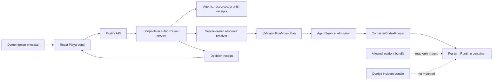

# ScopedRun project plan

## 1. Executive summary

**ScopedRun** is lightweight authorization middleware for tool-using Agents.
For each Agent Run, the control plane resolves the initiating human, checks the
Agent and requested resources, and compiles the approved grant into a validated
container mount plan. Resources outside that grant are absent from the
Runtime's filesystem namespace.

The project does not attempt to build production OAuth, a general policy
engine, or a hardened multi-tenant sandbox. It proves one focused contract end
to end:

> A human can delegate access to a specific server-owned resource for one
> Agent Run. An unauthorized resource is rejected before the Runner starts and
> is never mounted into the Runtime.

## 2. The problem

The Starter Kit is intentionally a single-user POC. Its shared bearer token
protects a remote demo, but it does not identify a human, establish Agent
ownership, or authorize access to individual resources.

This becomes important for an Agent because it does not follow a single UI
path. During one task it can inspect directories, run shell commands, and try
alternate file paths. Hiding a resource in React or adding “do not read other
projects” to the prompt does not constrain those execution paths.

### Concrete user story

An operations engineer asks an Agent to investigate an outage in the Orders
service. The platform holds two server-owned, synthetic incident bundles:

- `orders-incident`: explicitly granted to the engineer and the selected Agent;
- `payments-incident`: owned by another demo principal and not granted.

The Orders bundle should be readable during this Run. The Payments bundle
should not merely be hidden: its host path must be absent from the container
arguments and its Runtime path must not exist.

### Why this is middleware

The decision is made at a trusted backend boundary and changes the Runtime's
capabilities. The UI only requests a resource and displays the resulting
receipt. Enforcement belongs to the control plane, resource manager, and
container mount namespace.

## 3. Product promise and invariant

### Primary invariant

For every capsule-enabled Run:

```text
mountedResources(run) = resourcesAllowedByFrozenGrant(run)
```

Additionally:

1. an unauthorized request never invokes the Runner;
2. user input never becomes a host path without server-side resolution;
3. authorized demo resources are mounted read-only;
4. revocation prevents new Runs from using an old grant generation;
5. unsupported Runtime profiles fail closed;
6. every decision produces a secret-safe receipt.

### What success looks like

- A real Agent Run reads an allowed incident bundle and summarizes a known
  canary value.
- A denied Run returns a structured authorization decision before Runtime
  creation.
- The denied resource's path is absent from the mount plan and its bytes,
  hash, and modification time remain unchanged.
- Direct API calls cannot bypass the same policy used by the Web UI.

## 4. Non-goals

- Production authentication, OAuth, SSO, or a general RBAC product.
- Arbitrary HTTP/MCP tool authorization.
- Data-loss prevention after a resource has legitimately been granted.
- Hot revocation of an already mounted resource without stopping the Runtime.
- A hardened multi-tenant container boundary.
- User-controlled host paths or writable external resource mounts.
- Rebuilding Agent CRUD, Playground, model integration, or cloud deployment.

## 5. Architecture



### Trust boundaries

- The browser may request a `resourceId`, but cannot provide a principal ID,
  host path, mount destination, or access mode.
- Fastify resolves the principal from one of two server-configured demo tokens.
- `ResourceManager` maps a resource ID to a server-owned canonical path and
  rejects traversal, symlink escapes, and mount collisions.
- `AgentService` freezes the authorization decision and mount plan before it
  creates or launches the Run.
- `ContainerCodexRunner` accepts only a validated mount plan produced by the
  backend. It never resolves raw request paths.
- The Agent, prompt, and workspace cannot edit grants, receipts, or resource
  metadata.

## 6. Proposed domain model

The exact storage version and migration design will be decided during
implementation. The initial contract should remain small:

```ts
type PrincipalId = string;
type ResourceId = string;

interface DemoPrincipal {
  id: PrincipalId;
  displayName: string;
  tokenHash: string;
}

interface ProtectedResource {
  id: ResourceId;
  ownerId: PrincipalId;
  displayName: string;
  serverRelativePath: string;
}

interface ResourceGrant {
  id: string;
  humanId: PrincipalId;
  agentId: string;
  resourceId: ResourceId;
  mode: "read";
  generation: number;
  revokedAt: string | null;
}

interface RuntimeMount {
  resourceId: ResourceId;
  canonicalHostPath: string;
  runtimePath: string;
  mode: "ro";
}

interface AuthorizationReceipt {
  id: string;
  runId: string | null;
  humanId: PrincipalId;
  agentId: string;
  resourceIds: ResourceId[];
  decision: "allow" | "deny";
  reasonCode: string;
  policyHash: string;
  grantGeneration: number | null;
  createdAt: string;
}
```

`canonicalHostPath` is an internal value. It must never be accepted from the
browser or returned in a public API receipt.

## 7. End-to-end request flow

### Allowed Run

1. The browser sends a prompt and one resource ID.
2. Fastify resolves the demo principal from a server-configured token.
3. The control plane checks Agent ownership and the active grant generation.
4. `ResourceManager` resolves the resource ID under the configured resource
   root and compiles a read-only `RuntimeMount`.
5. The store records an allow receipt and freezes the mount plan for the Run.
6. `AgentService` calls the Runner with `runId` and the validated mounts.
7. `ContainerCodexRunner` appends read-only bind mounts to the container
   arguments.
8. The Agent reads `/resources/<resource-id>` and completes the task.

### Denied Run

1. The browser or a direct API caller requests another principal's resource.
2. The backend records a deny receipt with a stable reason code.
3. The Runner is not called and no Runtime container is created.
4. The protected resource remains unchanged.

### Revocation

Revocation increments the grant generation and prevents future Runs from using
the old grant. If an active Run already has the resource mounted, the honest
control is to stop and remove that Runtime; this project will not claim
instantaneous in-place unmounting.

## 8. API sketch

The names may change during implementation. The minimum product surface is:

```text
GET  /api/resources
POST /api/agents/:agentId/grants
POST /api/grants/:grantId/revoke
POST /api/agents/:agentId/messages  { prompt, resourceIds }
GET  /api/runs/:runId/authorization
```

The authorization path must also run when the message endpoint is called
directly. The React resource picker is not an enforcement mechanism.

## 9. Minimal code seams

Expected backend changes:

- `apps/server/src/types.ts`: principals, resources, grants, receipts, and
  validated mounts; add `runId` and mounts to `RunnerRequest`.
- `apps/server/src/app.ts`: resolve the demo principal and expose the small
  grant/resource/receipt API.
- `apps/server/src/agent-service.ts`: perform authorization and freeze the mount
  plan during Run admission; deny before invoking the Runner.
- `apps/server/src/resource-manager.ts`: new server-owned path resolver and
  mount-plan compiler.
- `apps/server/src/container-codex-runner.ts`: append validated read-only mounts.
- `apps/server/src/codex-runner.ts`: fail closed for capsule Runs in the local
  process profile, because it lacks an equivalent filesystem namespace.
- Store and tests: persist the minimum demo model and structured receipts.

Expected Web changes:

- select one eligible resource next to the Playground prompt;
- display an allow/deny receipt with actor, Agent, Run, resource, mode, and
  reason code;
- avoid exposing tokens, host paths, resource content, or policy internals.

## 10. Three-day implementation plan

### Day 1 — Prove the boundary

- Run the untouched baseline acceptance flow.
- Complete the no-UI spike in `SCOPEDRUN_DAY1_SPIKE.md`.
- Freeze the domain vocabulary and trusted-boundary contract.
- Add the smallest backend allow/deny path with a fake Runner.

Exit evidence: one real container reads the allowed bundle; the denied bundle
is absent; deny invokes no Runner.

### Day 2 — Complete the vertical slice

- Persist resources, grants, and authorization receipts.
- Integrate the validated mount plan into the real container Runner.
- Add revocation generation semantics.
- Add the resource picker and decision receipt view.
- Complete positive, negative, traversal, and direct-API tests.

Exit evidence: browser → backend decision → real Runtime mount → receipt works
end to end.

### Day 3 — Robustness and delivery

- Finish container-engine integration tests and cleanup handling.
- Confirm unsupported Runtime profiles fail closed.
- Scan logs, API responses, screenshots, and Git history for secrets.
- Finalize README, one-page architecture diagram, limitations, and demo steps.
- Rehearse the demo repeatedly until it finishes under three minutes.

Exit evidence: `npm run check` passes and the scripted demonstration is
repeatable without hidden setup.

## 11. Three-minute demo script

| Time | Action | Evidence |
| --- | --- | --- |
| 0:00–0:25 | Introduce Orders and Payments incident bundles and select the Orders Agent. | Two synthetic resources and one explicit grant. |
| 0:25–1:05 | Ask the real Agent to read Orders and summarize its known canary. | Successful Agent Run and read-only mount receipt. |
| 1:05–1:40 | Request Payments from the same Agent, including through a direct API call. | Backend deny; Runner not started. |
| 1:40–2:10 | Show the actual mount manifest and probe the expected Runtime path. | Payments host path absent; Runtime path does not exist. |
| 2:10–2:35 | Show Payments SHA-256/mtime before and after. | Protected bytes unchanged. |
| 2:35–3:00 | Revoke Orders, retry, then state the limitations. | New Run denied; receipt has new generation/reason. |

The demo must never rely on the model saying “I cannot access that file” as the
only proof. The evidence comes from the backend decision and container facts.

## 12. Mapping to judging criteria

| Category | How ScopedRun addresses it |
| --- | --- |
| End-to-end behavior — 40% | Browser request reaches backend authorization and changes the real Runtime mount namespace. |
| Technical design — 25% | Clear human→Agent→Run→resource delegation boundary; focused `AgentService` and Runner contracts. |
| Verification — 20% | Allow/deny matrix, zero Runner calls on deny, path-escape tests, read-only integration test, revocation generation, secret-safe receipts. |
| Demo and reproducibility — 15% | Two deterministic local fixture bundles, container-only path, no cloud requirement, three-minute scripted evidence. |

## 13. Risks and mitigations

| Risk | Mitigation / kill condition |
| --- | --- |
| Nested read-only mount semantics differ across Docker, Colima, or Podman. | Day 1 test on the judging engine; kill the idea if the invariant cannot be proved. |
| Identity scope expands into OAuth/RBAC. | Keep two server-configured demo principals and one `read` action. |
| A resource path escapes its configured root. | Resolve IDs server-side; enforce realpath containment and reject symlinks/traversal. |
| Active revocation is overstated. | Stop/remove the active Runtime; only promise immediate denial for future Runs. |
| UI becomes the policy boundary. | Direct-API negative tests and fake-Runner call-count assertion. |
| Demo looks like an ordinary file picker. | Show mount manifest absence, real Runtime probe, zero Runner start, and complete decision receipt. |
| Allowed data can be copied elsewhere. | State clearly that ScopedRun is least-privilege delegation, not DLP. |

## 14. Acceptance checklist

- [ ] Untouched baseline Agent CRUD, lifecycle, Playground, and multi-turn flow
      still work.
- [ ] Authorized resource is read by a real containerized Agent Run.
- [ ] Unauthorized resource is rejected before Runner invocation.
- [ ] Browser input cannot specify human ID, host path, mount destination, or
      access mode.
- [ ] Path traversal, symlink escape, and mount collision fail closed.
- [ ] Authorized resources are read-only and unchanged after the Run.
- [ ] Revoked grant generations are rejected for new Runs.
- [ ] Unsupported Runtime profiles fail closed.
- [ ] Decision receipts contain no token, canonical host path, or resource
      content.
- [ ] Positive and negative cases have automated tests.
- [ ] `npm run check` passes.
- [ ] No secret appears in source, Git history, logs, receipts, screenshots, or
      browser storage.
- [ ] The live demo fits within three minutes.

## 15. Open decisions after the Day 1 spike

These choices should not be finalized until the container proof succeeds:

1. whether one Run may mount one resource or a small set;
2. exact runtime path naming and collision rules;
3. whether grants are Agent-level with a Run snapshot or explicitly single-use;
4. whether resource metadata belongs in the existing JSON store or a fixed
   fixture manifest;
5. the smallest receipt fields needed for the Demo without leaking internals.
